# DevOps Assignment Report
## Task 1: Prepare the ML Project 

### Repository Forking and Cloning

The project was initialized by forking the original repository from GitHub and cloning it to the local machine.

**Steps:**
1. Forked the repository from the original source
2. Cloned the forked repository to local workspace
3. Navigated to the project directory

**Screenshots:**

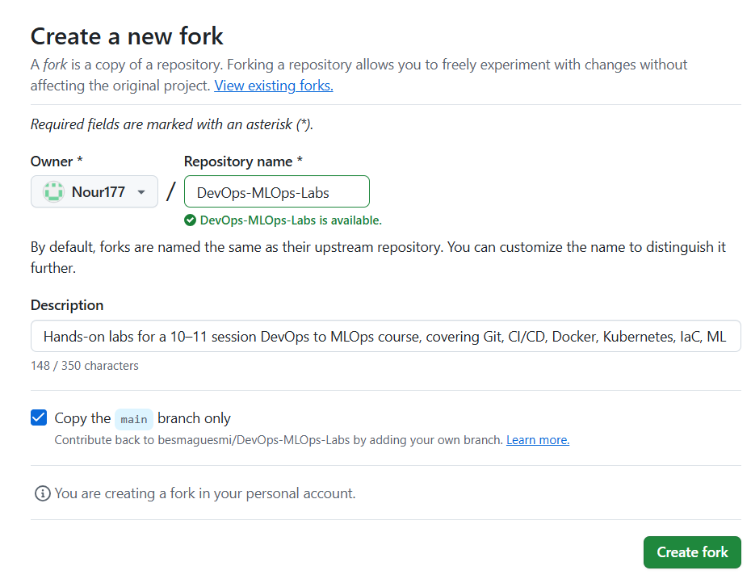

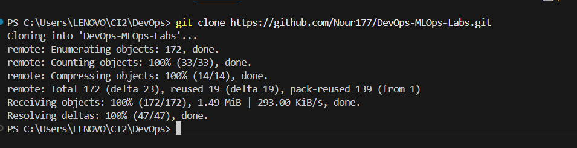

---

## Task 2: Run the app locally

This section documents the steps to set up and run the application locally, including virtual environment creation, dependency installation, and application execution.

### 1. Virtual Environment Setup

A Python virtual environment was created to isolate project dependencies and ensure consistent development and deployment environments.

**Steps:**
1. Created a virtual environment using Python's `venv` module:
   ```bash
   python -m venv .venv
   ```

2. Activated the virtual environment:
     ```bash
     .venv\Scripts\activate
     ```

**Screenshots:**

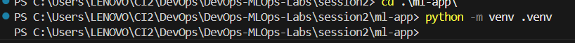


### 2. Dependencies Installation

Project dependencies were installed from the `requirements.txt` file to ensure all necessary packages are available.

**Steps:**
1. Installed dependencies from requirements file:
   ```bash
   pip install -r requirements.txt
   ```
**Screenshots:**

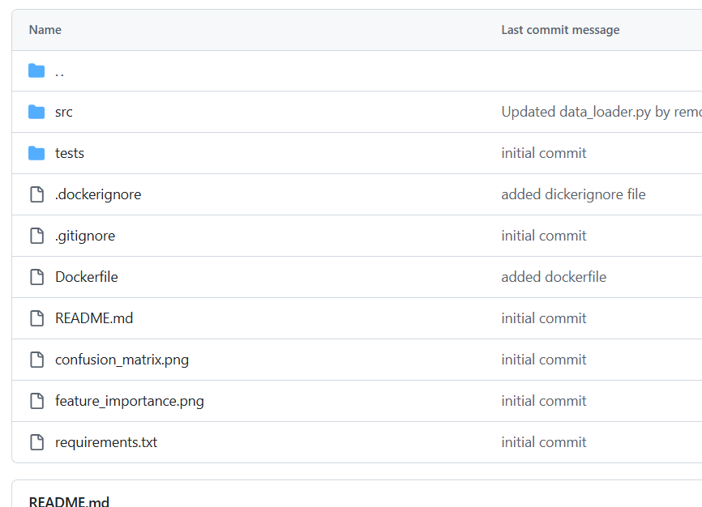

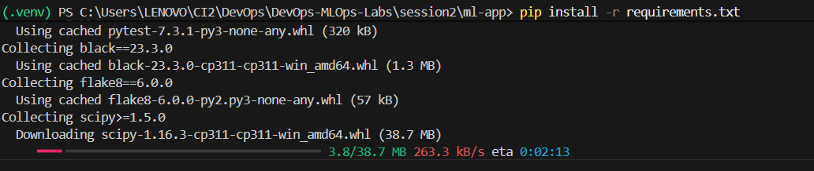

### 3. Running the Application

Once the virtual environment is activated and dependencies are installed, the application can be executed.

**Train the Model:**
   ```bash
   python src/train.py
   ```

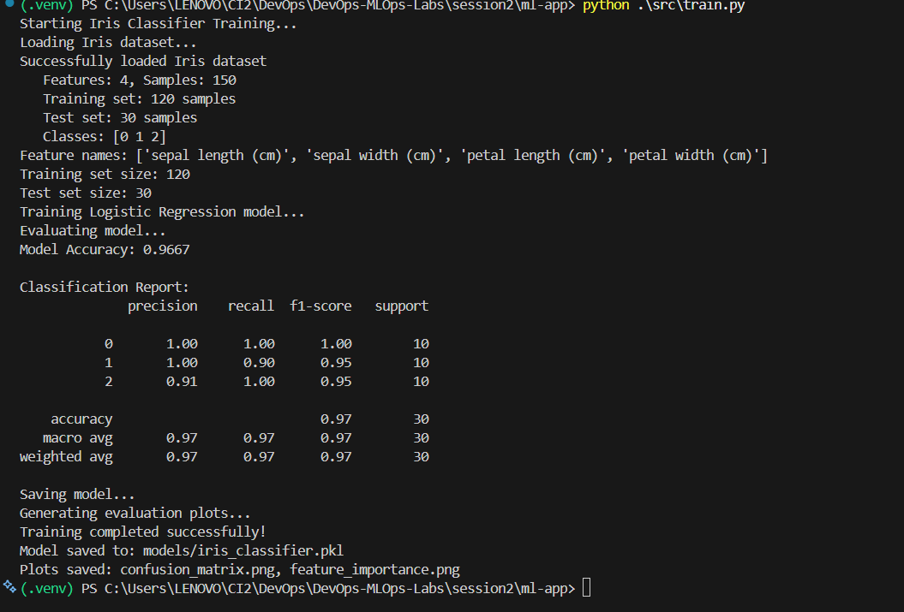

### 4. Testing Endpoints

To test the application endpoints (if the app has a web interface or API):

1. **Start the Application Server** :
   ```bash
   python src/app.py
   # or
   flask run
   ```

2. **Test Endpoints:**
   - **Using curl** (for API endpoints):
     ```bash
     # GET request
     curl http://localhost:5000/api/endpoint
     
     # POST request
     curl -X POST http://localhost:5000/api/predict \
          -H "Content-Type: application/json" \
          -d '{"feature1": value1, "feature2": value2}'
     ```
   
   - **Using a web browser** (for web interface):
     - Navigate to `http://localhost:5000` or the specified port
     - Interact with the web interface to test functionality
   
---
## Task 3: Write unit tests

A `tests/` folder was created to organize all test files following pytest conventions.
 Running Tests Locally

Tests were verified to run successfully using pytest in the local environment.

**Screenshot:**


---

## Task 4: Linting & formatting

### 1. Flake8 Installation

Flake8 was installed as the linter for Python code style and quality checks.

**Installation:**
```bash
pip install flake8
```

**What is Flake8?**
Flake8 is a Python tool that combines PyFlakes (static analysis), pycodestyle (PEP 8 style checker), and McCabe (complexity checker) to check Python code for style issues, logical errors, and complexity problems.

### 2. Flake8 Configuration

A minimal configuration file was created to customize flake8 behavior according to project needs.

**Configuration Explanation:**
- `max-line-length`: Maximum allowed line length (default is 79, commonly set to 100 or 120)
- `exclude`: Directories and files to exclude from linting (virtual environments, cache files, etc.)
- `ignore`: Error codes to ignore (E203, E266, E501, W503 are common exceptions)

**Screenshot:**

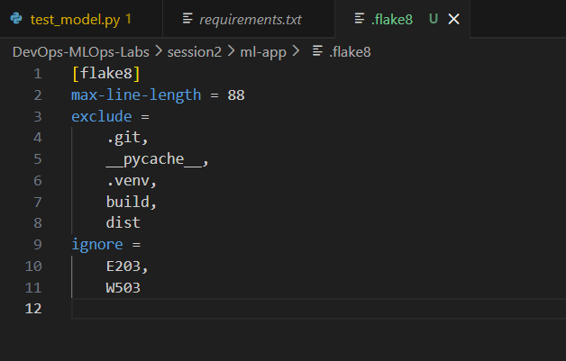

### 3. Running Flake8

Flake8 was executed to check code quality and ensure the code meets basic style checks.


**Screenshot:**

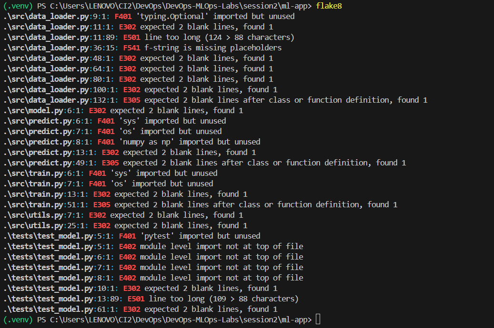


A GitHub Actions workflow file was created at `.github/workflows/ci.yml` to define the CI pipeline.

**Workflow Triggers:**
- Runs on `push` to any branch
- Runs on `pull_request` to any branch

The workflow includes all required steps to ensure code quality and build artifacts.

**Complete Workflow File: `.github/workflows/ci.yml`**

**Screenshots:**

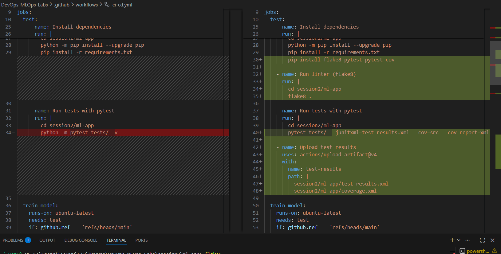


## Task 6: Containerise the app

### 1. Dockerfile Creation

A Dockerfile was created (or added if not present) to describe how to build the application image. The Dockerfile ensures the container is runnable and exposes the application port.

**Dockerfile Structure:**

```dockerfile
FROM python:3.9-slim

# Set working directory
WORKDIR /app

# Copy requirements file
COPY requirements.txt .

# Install dependencies
RUN pip install --no-cache-dir -r requirements.txt

# Copy application code
COPY . .

# Expose the application port (adjust port number as needed)
EXPOSE 5000

# Set default command to run training
CMD ["python", "src/train.py"]
```

**Dockerfile Explanation:**
- **Base Image**: Uses `python:3.9-slim` for a lightweight Python environment
- **Working Directory**: Sets `/app` as the working directory
- **Dependencies**: Installs all required packages from `requirements.txt`
- **Application Code**: Copies all application files to the container
- **Port Exposure**: Exposes port 5000 (or the port your app uses) using `EXPOSE` directive
- **Default Command**: Runs the training script when the container starts

**Screenshot:**

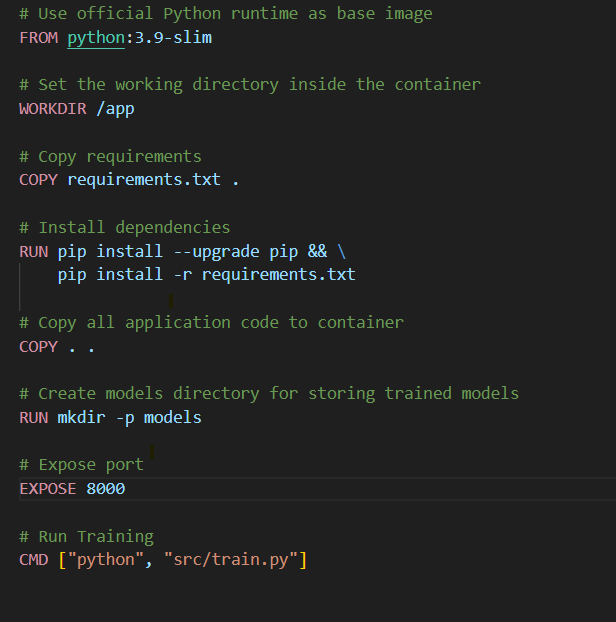

### 2. Building the Docker Image

The Docker image was built from the Dockerfile to create a runnable container.

**Build Command:**
```bash
docker build -t ml-app:latest .
```
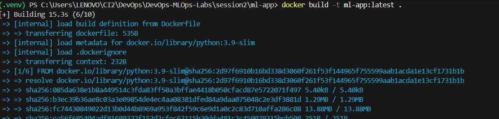